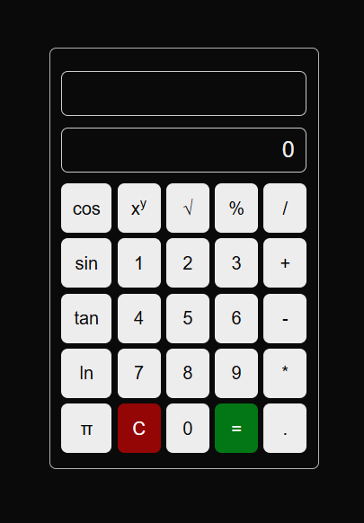

This is a [Next.js](https://nextjs.org) project bootstrapped with [`create-next-app`](https://nextjs.org/docs/app/api-reference/cli/create-next-app).

## Basic Calculator

This is a basic [calculator component](https://react-calculator-component.vercel.app/)

It does basic calculations such as Adding, Substracting, Multiplying and Dividing.

I also added a more advanced calculator, with added features, and better overall code!

Check out the demo [here](https://react-calculator-component.vercel.app/)

## Needed Credits

The UI was taken from [UiVerse](https://uiverse.io/emmanuelh-dev/jolly-duck-70).

Credits to respective owners.

##  License

[MIT](./License)

## Contact

[Github](https://github.com/elliek17) || Gmail: elliekarout@gmail.com

Any comments, issues, suggestions, or feedback is appreciated